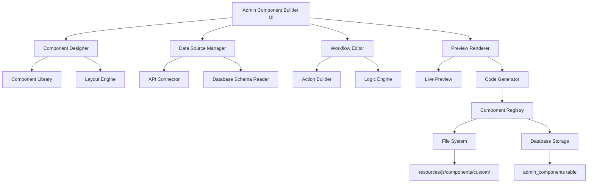
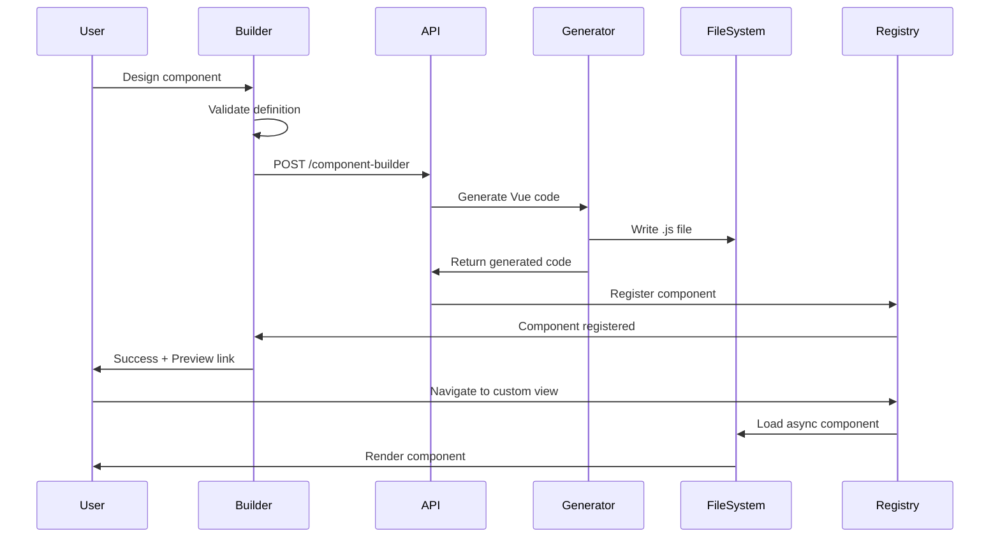

# Admin Builder for Vue Async Components

**Feature**: Visual Admin Panel Builder with Async Component Generation  
**Status**: � Phase 2: Implementation (Builder UI)
**Date**: December 15, 2025  
**Author**: System Architecture Team

---

## Executive Summary

This document outlines the architecture for a new admin panel feature that enables non-technical users to visually create custom admin panels as Vue async components. The builder will provide a drag-and-drop interface similar to the existing `FormBuilder` and `TemplateBuilder`, but specifically designed for creating administrative interfaces with CRUD operations, data visualization, and custom workflows.

> [!IMPORTANT]
> This feature will democratize admin panel creation, allowing business users to build custom admin interfaces without writing code, while maintaining the performance benefits of Vue async components.

---

## Problem Statement

### Current Limitations

1. **Developer Dependency**: Creating new admin panels requires JavaScript/Vue knowledge
2. **Rigid Structure**: Admin panels follow fixed patterns (CRUD tables, forms)
3. **No Visual Builder**: Unlike CMS pages and forms, admin panels lack a visual builder
4. **Slow Iteration**: Adding custom admin features requires code changes and deployments
5. **Limited Customization**: Non-developers cannot customize admin workflows

### User Pain Points

- **Business Analysts**: Cannot create custom dashboards for specific metrics
- **Operations Teams**: Need custom admin tools but lack development resources
- **Product Managers**: Want to prototype admin features quickly
- **Administrators**: Require specialized views for different user roles

---

## Proposed Solution

### Vision

A visual builder that generates Vue async components for admin panels, enabling users to:

1. **Design Layouts**: Drag-and-drop interface components (tables, forms, charts, cards)
2. **Configure Data Sources**: Connect to database tables, APIs, or custom endpoints
3. **Define Actions**: Create buttons, modals, and workflows without code
4. **Set Permissions**: Configure role-based access control
5. **Generate Components**: Export as async-loadable Vue components
6. **Hot Reload**: Preview changes in real-time without page refresh

### Key Features

#### 1. Component Library
Pre-built, configurable components:
- **Data Display**: Tables, cards, lists, grids, statistics
- **Data Input**: Forms, filters, search boxes, date pickers
- **Actions**: Buttons, dropdowns, modals, confirmations
- **Visualizations**: Charts (bar, line, pie), gauges, progress bars
- **Layout**: Containers, columns, tabs, accordions, panels

#### 2. Data Binding System
- Visual data source configuration
- Support for REST APIs, database tables, GraphQL
- Real-time data updates with WebSocket support
- Data transformation and filtering
- Computed fields and aggregations

#### 3. Workflow Builder
- Define button click actions
- Create multi-step workflows
- Conditional logic (if/then/else)
- API calls and data mutations
- Success/error handling

#### 4. Code Generation
- Generate clean, maintainable Vue 3 components
- Follow existing async component patterns
- Include proper error handling and loading states
- Generate TypeScript definitions (optional)
- Export as standalone `.js` files

#### 5. Component Registry
- Save and manage custom components
- Version control for component definitions
- Import/export component templates
- Share components across sites (multi-site support)

---

## Architecture Design

### System Components



### Data Model

#### Database Schema

```sql
-- Admin Components Table
CREATE TABLE admin_components (
    id INTEGER PRIMARY KEY AUTOINCREMENT,
    name TEXT NOT NULL UNIQUE,
    title TEXT NOT NULL,
    description TEXT,
    category TEXT DEFAULT 'custom',
    icon TEXT DEFAULT 'puzzle',
    view_name TEXT NOT NULL UNIQUE,
    definition TEXT NOT NULL, -- JSON component definition
    generated_code TEXT, -- Generated Vue component code
    version INTEGER DEFAULT 1,
    enabled BOOLEAN DEFAULT 1,
    admin_only BOOLEAN DEFAULT 1,
    created_by INTEGER,
    created_at DATETIME DEFAULT CURRENT_TIMESTAMP,
    updated_at DATETIME DEFAULT CURRENT_TIMESTAMP,
    FOREIGN KEY (created_by) REFERENCES users(id)
);

-- Component Versions (for rollback)
CREATE TABLE admin_component_versions (
    id INTEGER PRIMARY KEY AUTOINCREMENT,
    component_id INTEGER NOT NULL,
    version INTEGER NOT NULL,
    definition TEXT NOT NULL,
    generated_code TEXT,
    created_at DATETIME DEFAULT CURRENT_TIMESTAMP,
    FOREIGN KEY (component_id) REFERENCES admin_components(id) ON DELETE CASCADE
);

-- Component Permissions
CREATE TABLE admin_component_permissions (
    id INTEGER PRIMARY KEY AUTOINCREMENT,
    component_id INTEGER NOT NULL,
    role TEXT NOT NULL,
    can_view BOOLEAN DEFAULT 1,
    can_edit BOOLEAN DEFAULT 0,
    can_delete BOOLEAN DEFAULT 0,
    FOREIGN KEY (component_id) REFERENCES admin_components(id) ON DELETE CASCADE
);
```

#### Component Definition Schema

```javascript
{
  "name": "sales-dashboard",
  "title": "Sales Dashboard",
  "description": "Real-time sales metrics and reports",
  "icon": "trending-up",
  "layout": {
    "type": "container",
    "direction": "vertical",
    "gap": "20px",
    "children": [
      {
        "type": "header",
        "title": "Sales Overview",
        "subtitle": "Last 30 days"
      },
      {
        "type": "row",
        "columns": [
          {
            "type": "stat-card",
            "label": "Total Revenue",
            "dataSource": {
              "type": "api",
              "endpoint": "/@/v1/sales/revenue",
              "method": "GET",
              "transform": "data.total"
            },
            "format": "currency",
            "icon": "dollar-sign",
            "color": "green"
          },
          {
            "type": "stat-card",
            "label": "Orders",
            "dataSource": {
              "type": "api",
              "endpoint": "/@/v1/sales/orders",
              "method": "GET",
              "transform": "data.count"
            },
            "format": "number",
            "icon": "shopping-cart",
            "color": "blue"
          }
        ]
      },
      {
        "type": "data-table",
        "dataSource": {
          "type": "api",
          "endpoint": "/@/v1/sales/recent",
          "method": "GET",
          "transform": "data.items"
        },
        "columns": [
          { "key": "id", "label": "Order ID", "sortable": true },
          { "key": "customer", "label": "Customer", "sortable": true },
          { "key": "amount", "label": "Amount", "format": "currency" },
          { "key": "status", "label": "Status", "badge": true }
        ],
        "actions": [
          {
            "label": "View Details",
            "icon": "eye",
            "type": "modal",
            "modalComponent": "order-details",
            "params": ["id"]
          }
        ]
      }
    ]
  },
  "dataSources": {
    "revenue": {
      "type": "api",
      "endpoint": "/@/v1/sales/revenue",
      "refreshInterval": 30000
    }
  },
  "actions": {
    "refreshData": {
      "type": "function",
      "code": "async () => { await fetchData(); }"
    }
  }
}
```

---

## Implementation Plan

### Phase 1: Foundation (Week 1-2)

#### 1.1 Database Setup
- [x] Create migration for `admin_components` table
- [x] Create migration for `admin_component_versions` table
- [x] Create migration for `admin_component_permissions` table
- [x] Add seed data with example components

#### 1.2 Backend API
Create `AdminComponentBuilderController.php`:
- `GET /@/admin/component-builder/list` - List all components
- `GET /@/admin/component-builder/:id` - Get component definition
- `POST /@/admin/component-builder` - Create new component
- `PUT /@/admin/component-builder/:id` - Update component
- `DELETE /@/admin/component-builder/:id` - Delete component
- `POST /@/admin/component-builder/:id/generate` - Generate Vue code
- `POST /@/admin/component-builder/:id/preview` - Preview component
- `GET /@/admin/component-builder/templates` - Get component templates

#### 1.3 Component Storage
Create `AdminComponentManager.php` class:
- Load component definitions from database
- Generate Vue component code from JSON definition
- Save generated components to `resources/js/components/custom/`
- Handle versioning and rollback
- Validate component definitions

### Phase 2: Builder UI (Week 3-4)

#### 2.1 Main Builder Component
Create `ComponentBuilder.js`:
```javascript
// Structure similar to FormBuilder.js and TemplateBuilder.js
export default {
  name: 'ComponentBuilder',
  components: {
    ComponentToolbox,
    ComponentCanvas,
    ComponentProperties,
    ComponentPreview
  },
  setup() {
    const component = reactive({
      name: '',
      title: '',
      layout: { type: 'container', children: [] },
      dataSources: {},
      actions: {}
    });
    
    return {
      component,
      saveComponent,
      generateCode,
      previewComponent
    };
  }
}
```

#### 2.2 Component Toolbox
Create `ComponentToolbox.js`:
- Categorized component library (Data, Input, Actions, Layout, Charts)
- Drag-and-drop interface
- Component search and filtering
- Component templates

#### 2.3 Component Canvas
Create `ComponentCanvas.js`:
- Visual layout editor
- Nested component support
- Drag-to-reorder
- Responsive preview (desktop/tablet/mobile)
- Grid/flex layout options

#### 2.4 Properties Panel
Create `ComponentProperties.js`:
- Dynamic property editor based on component type
- Data source configuration
- Styling options (colors, spacing, borders)
- Event handler configuration
- Validation rules

#### 2.5 Code Generator
Create `ComponentCodeGenerator.js`:
- Transform JSON definition to Vue 3 component
- Generate template, setup, and style sections
- Include proper imports and dependencies
- Add error handling and loading states
- Generate TypeScript types (optional)

### Phase 3: Component Library (Week 5-6)

#### 3.1 Data Display Components
- `DataTable.js` - Sortable, filterable table
- `StatCard.js` - Metric display card
- `DataList.js` - List view with custom templates
- `DataGrid.js` - Grid layout for cards
- `Timeline.js` - Event timeline

#### 3.2 Data Input Components
- `DynamicForm.js` - Auto-generated forms from schema
- `FilterPanel.js` - Advanced filtering
- `SearchBox.js` - Search with autocomplete
- `DateRangePicker.js` - Date range selection

#### 3.3 Action Components
- `ActionButton.js` - Configurable button with actions
- `BulkActions.js` - Multi-select actions
- `ModalTrigger.js` - Open modal dialogs
- `ConfirmDialog.js` - Confirmation prompts

#### 3.4 Visualization Components
- `ChartWidget.js` - Chart.js wrapper
- `ProgressBar.js` - Progress indicators
- `Gauge.js` - Gauge/meter displays
- `Sparkline.js` - Inline mini charts

#### 3.5 Layout Components
- `Container.js` - Flex/grid container
- `Tabs.js` - Tabbed interface
- `Accordion.js` - Collapsible sections
- `Card.js` - Content card wrapper

### Phase 4: Integration (Week 7)

#### 4.1 Dynamic Component Loading
Update `site.js`:
```javascript
// Load custom components dynamically
const loadCustomComponents = async () => {
  const response = await fetch('/@/admin/component-builder/active');
  const components = await response.json();
  
  components.forEach(comp => {
    const AsyncComponent = defineAsyncComponent(
      () => import(`./components/custom/${comp.name}.js`)
    );
    
    // Register in component map
    customComponents[comp.view_name] = AsyncComponent;
  });
};
```

#### 4.2 Menu Integration
Auto-generate menu items from custom components:
```javascript
const customMenuItems = computed(() => {
  return customComponents.value.map(comp => ({
    label: comp.title,
    view: comp.view_name,
    icon: comp.icon,
    adminOnly: comp.admin_only,
    category: comp.category
  }));
});
```

#### 4.3 Permission System
Integrate with existing role-based access control:
```javascript
const canAccessComponent = (componentId) => {
  const permissions = store.state.user.componentPermissions;
  return permissions[componentId]?.can_view || false;
};
```

### Phase 5: Advanced Features (Week 8-9)

#### 5.1 Data Source Connectors
- REST API connector with authentication
- Database table connector (via existing API)
- GraphQL connector
- WebSocket connector for real-time data
- CSV/JSON file import

#### 5.2 Workflow Builder
Visual workflow editor:
- State machine for multi-step processes
- Conditional branching
- API calls and data transformations
- Email/notification triggers
- Scheduled tasks

#### 5.3 Component Templates
Pre-built templates:
- CRUD Admin Panel
- Analytics Dashboard
- User Management
- Content Moderation
- Report Generator
- Settings Panel

#### 5.4 Export/Import
- Export component as JSON
- Import component from JSON
- Share components between sites
- Component marketplace (future)

---

## Technical Specifications

### File Structure

```
resources/js/
├── components/
│   ├── ComponentBuilder.js          # Main builder interface
│   ├── custom/                      # Generated custom components
│   │   ├── SalesDashboard.js
│   │   ├── InventoryManager.js
│   │   └── ...
│   └── builder/                     # Builder sub-components
│       ├── ComponentToolbox.js
│       ├── ComponentCanvas.js
│       ├── ComponentProperties.js
│       ├── ComponentPreview.js
│       ├── ComponentCodeGenerator.js
│       └── library/                 # Component library
│           ├── DataTable.js
│           ├── StatCard.js
│           ├── ChartWidget.js
│           └── ...
│
class/GaiaAlpha/
├── Controller/
│   └── AdminComponentBuilderController.php
├── Model/
│   ├── AdminComponent.php
│   └── AdminComponentVersion.php
└── Service/
    ├── AdminComponentManager.php
    ├── ComponentCodeGenerator.php
    └── ComponentValidator.php

docs/architect/
└── admin_component_builder_plan.md  # This document
```

### Component Lifecycle



### Code Generation Example

**Input (JSON Definition):**
```json
{
  "name": "user-stats",
  "title": "User Statistics",
  "layout": {
    "type": "container",
    "children": [
      {
        "type": "stat-card",
        "label": "Total Users",
        "dataSource": {
          "type": "api",
          "endpoint": "/@/v1/users/count"
        }
      }
    ]
  }
}
```

**Output (Generated Vue Component):**
```javascript
import { ref, onMounted } from 'vue';
import StatCard from '../builder/library/StatCard.js';

export default {
  name: 'UserStats',
  components: { StatCard },
  template: `
    <div class="admin-page">
      <div class="admin-header">
        <h2 class="page-title">User Statistics</h2>
      </div>
      <div class="admin-content">
        <StatCard 
          label="Total Users" 
          :value="totalUsers" 
          :loading="loading"
        />
      </div>
    </div>
  `,
  setup() {
    const totalUsers = ref(0);
    const loading = ref(true);
    
    const fetchData = async () => {
      loading.value = true;
      try {
        const res = await fetch('/@/v1/users/count');
        const data = await res.json();
        totalUsers.value = data;
      } catch (error) {
        console.error('Failed to fetch user count:', error);
      } finally {
        loading.value = false;
      }
    };
    
    onMounted(fetchData);
    
    return { totalUsers, loading };
  }
};
```

---

## User Experience

### Builder Interface

```
┌─────────────────────────────────────────────────────────────┐
│  Component Builder                          [Save] [Preview] │
├─────────────┬───────────────────────────┬───────────────────┤
│             │                           │                   │
│  TOOLBOX    │       CANVAS              │   PROPERTIES      │
│             │                           │                   │
│ 📊 Data     │  ┌─────────────────────┐  │  Selected:        │
│  • Table    │  │  User Statistics    │  │  Stat Card        │
│  • List     │  │                     │  │                   │
│  • Grid     │  │  ┌───────────────┐  │  │  Label:           │
│  • Card     │  │  │ Total Users   │  │  │  [Total Users]    │
│             │  │  │               │  │  │                   │
│ 📝 Input    │  │  │    1,234      │  │  │  Data Source:     │
│  • Form     │  │  │               │  │  │  [API Endpoint ▼] │
│  • Filter   │  │  └───────────────┘  │  │                   │
│  • Search   │  │                     │  │  Endpoint:        │
│             │  │  [+ Add Component]  │  │  [/@/v1/users/... │
│ 🎯 Actions  │  │                     │  │                   │
│  • Button   │  └─────────────────────┘  │  Format:          │
│  • Modal    │                           │  [Number ▼]       │
│             │                           │                   │
│ 📈 Charts   │                           │  Icon:            │
│  • Bar      │                           │  [users ▼]        │
│  • Line     │                           │                   │
│  • Pie      │                           │  Color:           │
│             │                           │  [🎨 #4CAF50]     │
└─────────────┴───────────────────────────┴───────────────────┘
```

### Workflow

1. **Create Component**
   - Click "Create Component" in Component Builder admin panel
   - Enter name, title, description, icon
   - Choose category and permissions

2. **Design Layout**
   - Drag components from toolbox to canvas
   - Arrange components in containers
   - Configure responsive behavior

3. **Configure Data**
   - Select component on canvas
   - Configure data source in properties panel
   - Set data transformations and filters

4. **Add Actions**
   - Add action buttons
   - Define workflows (API calls, navigation, modals)
   - Set up event handlers

5. **Preview & Test**
   - Click "Preview" to see live component
   - Test data loading and interactions
   - Verify responsive behavior

6. **Save & Deploy**
   - Click "Save" to generate component
   - Component auto-registers in menu
   - Navigate to new admin panel

---

## Security Considerations

### Access Control

1. **Builder Access**: Only admins can access Component Builder
2. **Component Permissions**: Role-based access for custom components
3. **Data Source Validation**: Whitelist allowed API endpoints
4. **Code Injection Prevention**: Sanitize all user inputs
5. **XSS Protection**: Escape all dynamic content

### Code Generation Safety

```javascript
// Validate component definition
const validateDefinition = (definition) => {
  // Check for dangerous patterns
  const dangerousPatterns = [
    /<script/i,
    /javascript:/i,
    /on\w+=/i,  // onclick, onerror, etc.
    /eval\(/i,
    /Function\(/i
  ];
  
  const json = JSON.stringify(definition);
  for (const pattern of dangerousPatterns) {
    if (pattern.test(json)) {
      throw new Error('Potentially dangerous content detected');
    }
  }
  
  return true;
};
```

### API Endpoint Restrictions

```javascript
// Whitelist allowed data source endpoints
const allowedEndpoints = [
  /^\/@\/v1\//,           // Public API v1
  /^\/@\/admin\/db\//,    // Database API
  /^\/@\/admin\/api-/     // API Builder endpoints
];

const isAllowedEndpoint = (endpoint) => {
  return allowedEndpoints.some(pattern => pattern.test(endpoint));
};
```

---

## Performance Optimization

### Async Loading Strategy

```javascript
// Lazy load component library items
const componentLibrary = {
  DataTable: defineAsyncComponent(() => import('./library/DataTable.js')),
  StatCard: defineAsyncComponent(() => import('./library/StatCard.js')),
  ChartWidget: defineAsyncComponent(() => import('./library/ChartWidget.js'))
};

// Load only required components
const loadRequiredComponents = (definition) => {
  const required = new Set();
  
  const traverse = (node) => {
    if (node.type) required.add(node.type);
    if (node.children) node.children.forEach(traverse);
  };
  
  traverse(definition.layout);
  return Array.from(required);
};
```

### Caching Strategy

1. **Component Definitions**: Cache in memory after first load
2. **Generated Code**: Cache in database and file system
3. **Data Sources**: Implement configurable cache TTL
4. **Preview Renders**: Cache preview HTML for faster loading

### Bundle Size Management

- Keep component library modular
- Use tree-shaking for unused components
- Minimize generated code size
- Compress component definitions in database

---

## Testing Strategy

### Unit Tests

```javascript
// Test component code generation
describe('ComponentCodeGenerator', () => {
  it('should generate valid Vue component from definition', () => {
    const definition = {
      name: 'test-component',
      layout: { type: 'container', children: [] }
    };
    
    const code = generator.generate(definition);
    expect(code).toContain('export default');
    expect(code).toContain('setup()');
  });
  
  it('should sanitize dangerous content', () => {
    const definition = {
      name: 'test',
      layout: { 
        type: 'container', 
        children: [{ content: '<script>alert("xss")</script>' }] 
      }
    };
    
    expect(() => generator.generate(definition)).toThrow();
  });
});
```

### Integration Tests

1. **API Endpoints**: Test all CRUD operations
2. **Component Registration**: Verify components load correctly
3. **Menu Integration**: Test dynamic menu generation
4. **Permissions**: Verify role-based access control

### Manual Testing Checklist

- [ ] Create simple stat card component
- [ ] Create data table with API data source
- [ ] Add action buttons with workflows
- [ ] Test responsive layout
- [ ] Verify permissions work correctly
- [ ] Test component versioning and rollback
- [ ] Export and import component
- [ ] Test with multiple users simultaneously

---

## Migration Path

### Existing Components

Option to convert existing hand-coded components to builder format:

1. **Parse Existing Code**: Extract component structure
2. **Generate Definition**: Create JSON definition
3. **Validate**: Ensure generated definition matches original
4. **Migrate**: Replace with builder-generated version

### Backward Compatibility

- Existing async components continue to work
- Builder-generated components follow same patterns
- No breaking changes to `site.js` or menu system

---

## Future Enhancements

### Phase 2 Features (3-6 months)

1. **AI-Assisted Design**
   - Natural language component generation
   - Smart layout suggestions
   - Auto-optimize for performance

2. **Component Marketplace**
   - Share components with community
   - Download pre-built templates
   - Rate and review components

3. **Advanced Visualizations**
   - D3.js integration
   - Custom chart types
   - Interactive data exploration

4. **Workflow Automation**
   - Scheduled tasks
   - Email notifications
   - Webhook integrations
   - Approval workflows

5. **Multi-Site Sync**
   - Share components across sites
   - Central component repository
   - Version control integration

6. **Mobile App Builder**
   - Generate React Native components
   - Progressive Web App support
   - Native mobile layouts

---

## Success Metrics

### Adoption Metrics
- Number of custom components created
- Number of active users using builder
- Time saved vs. hand-coding components

### Performance Metrics
- Component load time < 200ms
- Builder UI response time < 100ms
- Generated code size < 10KB average

### Quality Metrics
- Zero XSS vulnerabilities
- 95%+ uptime for custom components
- < 1% error rate in generated code

---

## Risks & Mitigation

| Risk | Impact | Probability | Mitigation |
|------|--------|-------------|------------|
| Code injection vulnerabilities | High | Medium | Strict validation, sanitization, code review |
| Performance degradation | Medium | Low | Lazy loading, caching, bundle optimization |
| User adoption resistance | Medium | Medium | Excellent documentation, templates, training |
| Complex components hard to build | Medium | High | Rich component library, templates, examples |
| Generated code maintenance | Low | Medium | Version control, rollback capability |

---

## Dependencies

### External Libraries
- **Vue 3**: Core framework (already in use)
- **Lucide Icons**: Icon library (already in use)
- **Chart.js**: Charting library (new dependency)
- **Monaco Editor**: Code editor for advanced users (optional)

### Internal Dependencies
- Existing async component system
- API Builder infrastructure
- Database Manager
- User authentication and permissions

---

## Documentation Requirements

### Developer Documentation
- Component definition schema reference
- Code generation API
- Custom component development guide
- Security best practices

### User Documentation
- Builder UI walkthrough
- Component library reference
- Tutorial: Building your first admin panel
- Video tutorials for common use cases

### API Documentation
- REST API endpoints
- Component definition format
- Data source connectors
- Webhook integration

---

## Timeline & Milestones

### Week 1-2: Foundation
- ✅ Database schema
- ✅ Backend API
- ✅ Component storage system

### Week 3-4: Builder UI
- ✅ Main builder interface
- ✅ Toolbox and canvas
- ✅ Properties panel
- ⏳ Code generator

### Week 5-6: Component Library
- ⏳ Data display components
- ⏳ Input components
- ⏳ Action components
- ⏳ Visualization components

### Week 7: Integration
- ⏳ Dynamic component loading
- ⏳ Menu integration
- ⏳ Permission system

### Week 8-9: Advanced Features
- ⏳ Data source connectors
- ⏳ Workflow builder
- ⏳ Component templates
- ⏳ Export/import

### Week 10: Testing & Documentation
- ⏳ Unit and integration tests
- ⏳ User documentation
- ⏳ Video tutorials
- ⏳ Performance optimization

---

## Conclusion

The Admin Component Builder will significantly enhance Gaia Alpha's extensibility by enabling non-technical users to create custom admin panels visually. By leveraging the existing async component architecture and following established patterns from `FormBuilder` and `TemplateBuilder`, we can deliver a powerful yet intuitive tool that maintains code quality and performance.

### Next Steps

1. **Review & Approval**: Stakeholder review of this plan
2. **Prototype**: Build minimal viable builder (Week 1-4)
3. **User Testing**: Gather feedback from early adopters
4. **Iterate**: Refine based on user feedback
5. **Launch**: Roll out to production with documentation

---

## Appendix

### A. Component Type Reference

| Type | Description | Props | Data Source |
|------|-------------|-------|-------------|
| `stat-card` | Metric display card | label, value, icon, color | API, computed |
| `data-table` | Sortable table | columns, actions, pagination | API, database |
| `chart-widget` | Chart visualization | type, data, options | API, computed |
| `action-button` | Button with action | label, icon, action | N/A |
| `dynamic-form` | Auto-generated form | schema, submit | API |

### B. Data Source Types

- **API**: REST API endpoint
- **Database**: Direct database table access
- **GraphQL**: GraphQL query
- **WebSocket**: Real-time data stream
- **Computed**: Derived from other data sources
- **Static**: Hard-coded data

### C. Action Types

- **Navigate**: Change view
- **API Call**: Execute API request
- **Modal**: Open modal dialog
- **Confirm**: Show confirmation dialog
- **Download**: Download file
- **Custom**: Execute custom JavaScript

---

**Document Version**: 1.0  
**Last Updated**: December 14, 2025  
**Next Review**: January 2026
